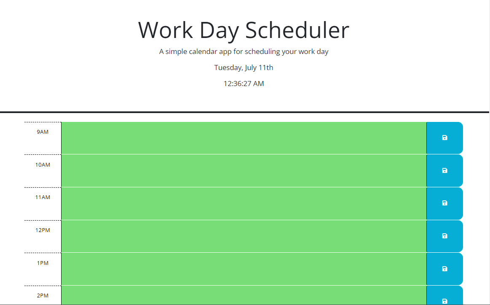

# Web-Calendar

## Description

The Web Calendar is a user-friendly application for managing schedules and events. Easily create, view, and organize appointments.The application utilizes local storage for seamless data persistence. Developed during a UCB Ext bootcamp. [Link to Deployed page](https://meanbean87.github.io/web-calendar/).



## Technology Used

| Technology | Badge                                                           | Documentation                                                                    |
| ---------- | --------------------------------------------------------------- | -------------------------------------------------------------------------------- |
| HTML       |                | [HTML Documentation](https://developer.mozilla.org/en-US/docs/Web/HTML)             |
| CSS        |                    | [CSS Documentation](https://developer.mozilla.org/en-US/docs/Web/CSS)               |
| JavaScript |  | [JavaScript Documentation](https://developer.mozilla.org/en-US/docs/Web/JavaScript) |
| Git        |          | [Git Documentation](https://git-scm.com/)                                           |

## JavaScript Example

```JavaScript
 //Updates the day and time displayed, and calls updateClasses.
function updateTime() {
  const dayJsTime = dayjs();
  $("#currentDay").text(dayJsTime.format("dddd, MMMM Do"));
  $("#currentTime").text(dayJsTime.format("h:mm:ss A"));
  updateClasses(dayJsTime);
}

//Updates the time on the next repaint of the animation frame.
function startTimerInterval() {
  updateTime();
  requestAnimationFrame(startTimerInterval);
}
```

## Learning Points

1. Request Animation Frame: The Web Calendar utilizes the requestAnimationFrame method, a powerful feature in JavaScript for smooth and efficient animations. By leveraging requestAnimationFrame, the application achieves optimal rendering performance by synchronizing animations with the browser's refresh rate. This results in visually pleasing and responsive user experiences.
2. Local Storage: The Web Calendar utilizes the browser's local storage feature to store and retrieve data locally. This enables seamless data persistence, allowing users to access their schedules and events even after closing and reopening the application. Local storage is a convenient way to save and retrieve user-specific data without the need for server-side storage or databases.

## Usage

To use the Web Password Generator:

1. Visit the deployed site [here](https://meanbean87.github.io/web-calendar/).
2. Click on the textarea fields and enter your reminder.
3. Click the save icon. This will save your data to localStorage for persistence.
4. The colors of the textarea will change depending on whether the hour has passed (grey), is the current hour (red), or is in the future (green).
5. The Web Password Generator also features a dynamic date and clock display..

## Author Info

Michael Mattingly

- GitHub: [meanbean87](https://github.com/meanbean87)
- LinkedIn: [Michael Mattingly](https://www.linkedin.com/in/michael-mattingly-5580b1280/)

## Credits

- The Web Password Generator was created by [meanbean87](https://github.com/meanbean87), with source code provided from UC Berkeley Extension.
- Favicon owned by Michael Mattingly.
- Source-code provided from UC Berkeley EXT.
- Uses DayJs for date functions.
- Uses Bootstap CDN, Font Awesome CDN, and fonts from Google Fonts CDN.

## License

This project is licensed under the [MIT License](LICENSE).
